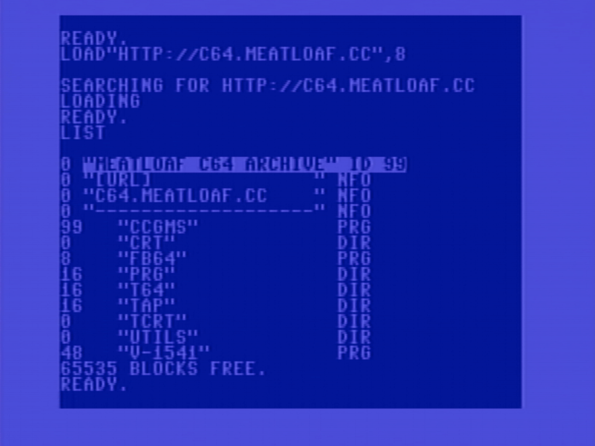

# meatloaf-svr

Server for hosting software via HTTP for use with [Meatloaf](https://github.com/idolpx/meatloaf).  
A Commodore 64/128 multi-device emulator. 

INSTALLATION
* Copy the "api" folder to your PHP enabled webserver
* Edit the settings in "api/config.php"
* Configure MIME Types for each file extension you will be hosting on the server as "application/octet-stream" (.D64, .D81, .D71, .T64, .TAP, .CRT, etc.)
